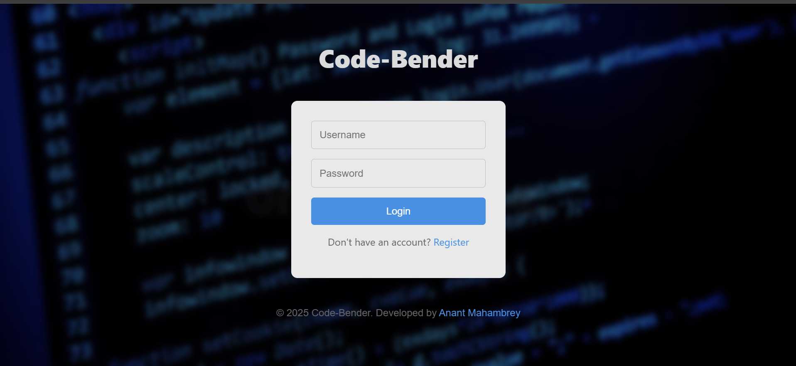
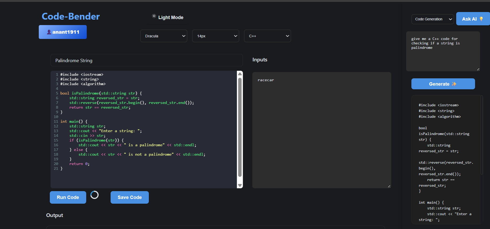
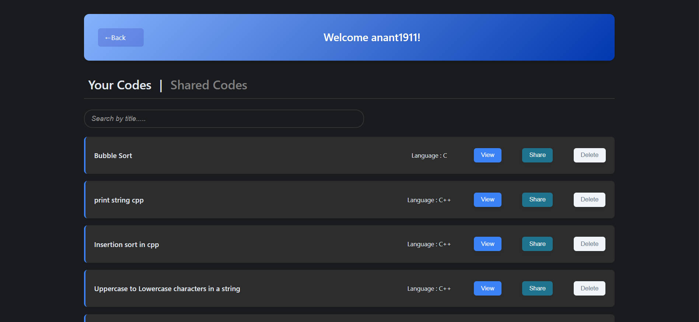
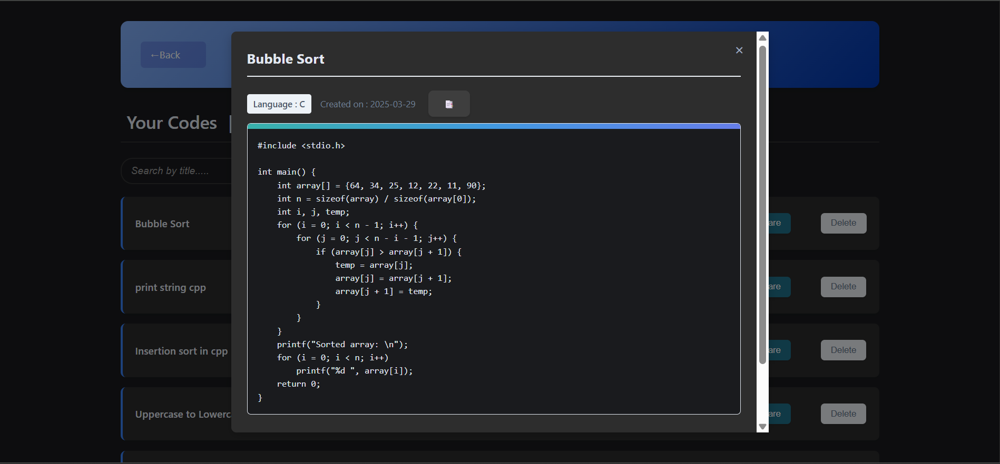
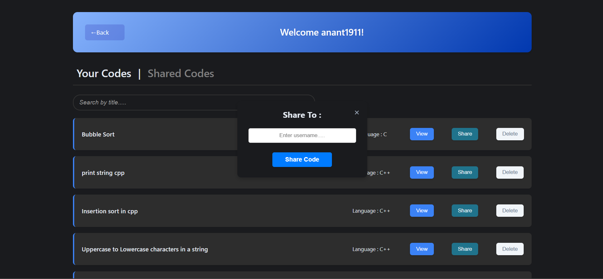
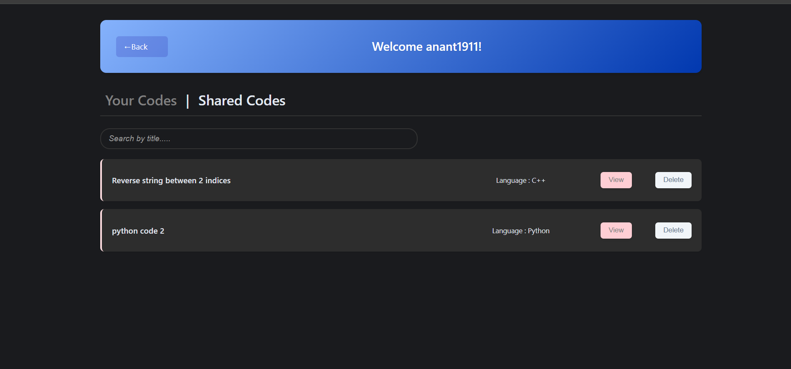
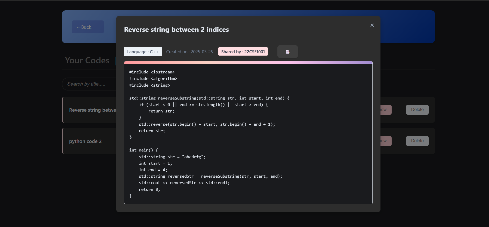

# Code-Bender : AI-Assisted Online Code Editor

## Overview ✨
Code-Bender is a web-based code editor built with Django and CodeMirror that allows users to write, edit, and execute code in various programming languages. 
It provides users with an easy-to-use interface to code in several languages, with AI Assistance.
Code-Bender is a one stop coding platform for all coders, wherein they can write, save and even share their codes with other users.

## Features ⚙️
- **User Profile**
  - User can create dedicated profiles to store all their codes and share them with peers.

- **Multi-language Support**
  Currently we provide support for 5 major programming languages.
  - Python
  - JavaScript
  - C
  - C++
  - Java

- **Theme Customization**
  Several themes and modes(Dark/Light) available for customization.

- **Code Execution**
  - Real-time code execution using RapidAPI's Code Compiler
  - Output display
  - Error handling

- **AI Assistance**
  - Real Time Code Generation.
  - Code Debugging and Error Identification.
  - Solving General Programming Queries using AI.

- **Easy to use UI**
  - Toggleable sidebar
  - Separate output display
  - Scrollable content
  - Clean and sleek UI

- **Code storage**
  - User can save their code on Code-Bender itself
  - Revisit and use previously saved code as and when desired

- **Code sharing**
  - Allows users to share their codes with other users, with just one click.
  - No need of any external messenger to share your code with collaborators!

## Tech Stack 🤖
- Backend: Django
- Frontend: HTML, CSS, JavaScript
- LightWeight Code Editor: CodeMirror
- Code Execution: RapidAPI Code Compiler
- AI Assistance: Google Gemini API
- Additional Libraries: requests
- Databse: sqlite

## Installation 🖥️

1. Clone the repository:
```bash
git clone https://github.com/anantmahambrey/AI-Assisted-Code-Editor.git
cd code_editor
```

2. Install required packages:
```bash
pip install django requests google.generativeai
```

3. Apply migrations:
```bash
python manage.py migrate
```

4. Run the development server:
```bash
python manage.py runserver
```

5. Visit `http://localhost:8000` in your browser to view code-bender

## Usage 🪴

### Login and Register
1. Login using your credentials (password and username)
2. If dont have an account, create one using register
3. Login upon registering your account

### Code Editor
1. Select your preferred programming language from the dropdown
2. Choose a theme and mode and font-size if desired
3. Write your code in the editor
4. Enter the program inputs in the input field
5. Click "Run Code" to execute
6. View output below the editor

### Code Saving
1. Enter the code title
2. Click on save code button below the editor
3. Write an optional code description
4. Click "Save Code" to save your code

### AI Assistance
1. Click "Ask AI" to show/hide the sidebar
2. Enter your doubt/problem
3. Click "Generate" to process the text
4. View results in the scrollable output area

### View your profile
1. Click on your username on the top left corner
2. View all your saved codes.
3. Click on "view" to view any code
4. Click on "delete" to delete any saved code
5. Click on "share" to share code to collaborator. Enter username of person to be shared to and click "share code"
6. Click on Shared Codes to view all codes shared to you.

## Why Code-Bender?
- One stop online platform to fulfill all your coding needs. Edit your code, execute your code, save your code, debug your code, share your code, take assistance from AI, all in a single web based platform - Code-Bender.

## Acknowledgments 😀
- CodeMirror for the text editor
- Google Gemini API for the AI Assistance
- RapidAPI for code execution
- Django community for the framework
- Contributors and testers

##### Let's get coding!✔️







